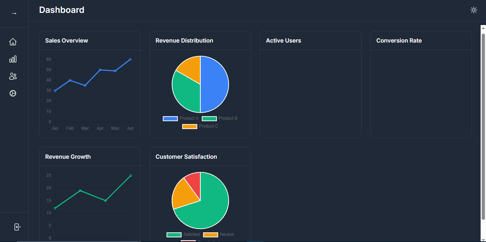
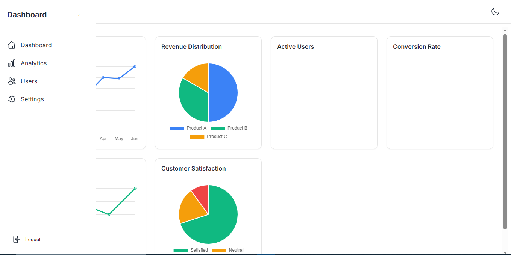

# Modern Professional Dashboard

A sleek, responsive dashboard built with Next.js 14, featuring a modern UI design and essential analytics capabilities. This project demonstrates best practices in frontend development with a focus on user experience and performance.




## 🌟 Features

- **Modern UI/UX Design**
  - Clean and intuitive interface
  - Responsive layout for all devices
  - Smooth animations and transitions

- **Theme Support**
  - Dark mode / Light mode toggle
  - Persistent theme preference
  - Custom color schemes

- **Analytics Dashboard**
  - Sample analytics with dummy data
  - Interactive charts and graphs
  - Key performance indicators
  - Data visualization components

- **Performance Optimized**
  - Server-side rendering with Next.js
  - Optimized image loading
  - Fast page transitions

## 🚀 Getting Started

### Prerequisites

- Node.js 18.0 or later
- npm or yarn package manager

### Installation

1. Clone the repository:
   ```bash
   git clone [your-repo-url]
   cd professional-dashboard
   ```

2. Install dependencies:
   ```bash
   npm install
   # or
   yarn install
   ```

3. Run the development server:
   ```bash
   npm run dev
   # or
   yarn dev
   ```

4. Open [http://localhost:3000](http://localhost:3000) in your browser

## 🛠️ Tech Stack

- **Framework:** Next.js 14
- **Styling:** CSS Modules
- **State Management:** React Context
- **Icons:** [Your icon library]
- **Charts:** [Your chart library]

## 📝 Project Structure

```
professional-dashboard/
├── src/
│   ├── app/              # Next.js app directory
│   ├── components/       # Reusable UI components
│   ├── context/         # React context providers
│   └── modules/         # Feature-specific modules
├── public/              # Static assets
└── ...config files
```

## 🔜 Upcoming Features

- [ ] Real-time data integration
- [ ] User authentication
- [ ] Custom dashboard widgets
- [ ] Data export functionality
- [ ] Advanced filtering options
- [ ] Mobile app version

## 🤝 Contributing

Contributions are welcome! Please feel free to submit a Pull Request.

## 📄 License

This project is licensed under the MIT License - see the [LICENSE](LICENSE) file for details.


---

Made with ❤️ by superDev
